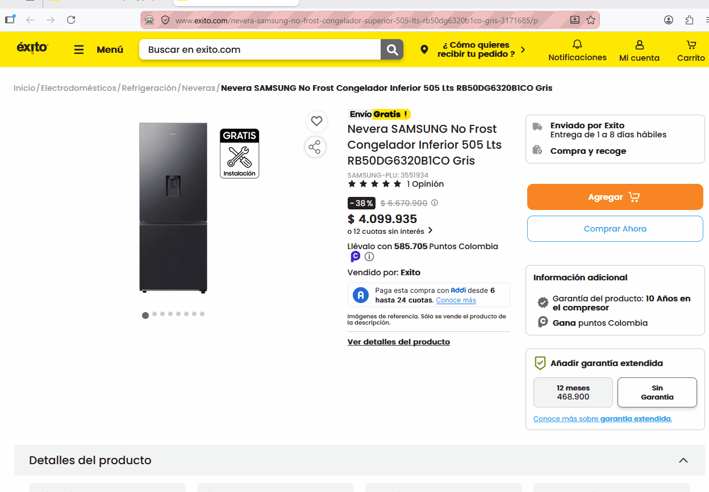
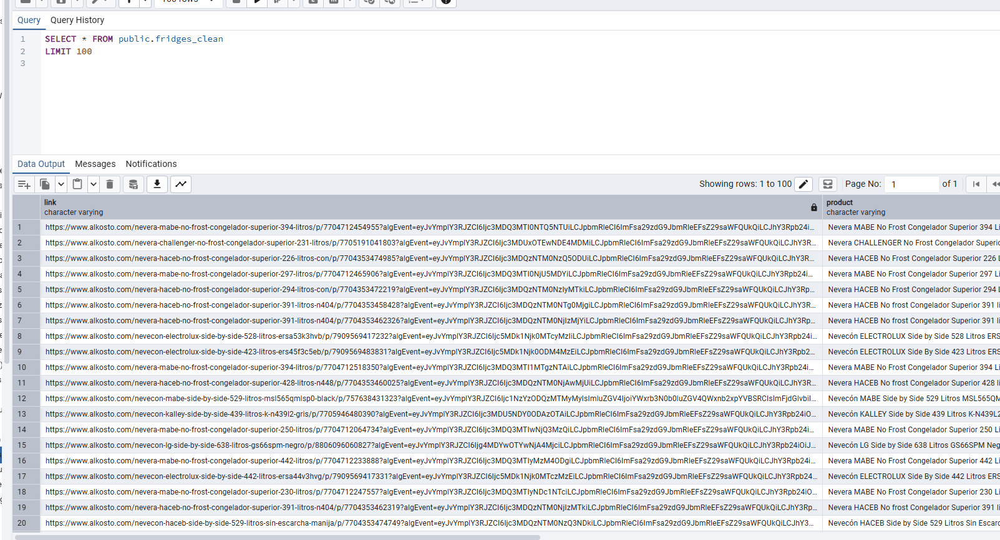
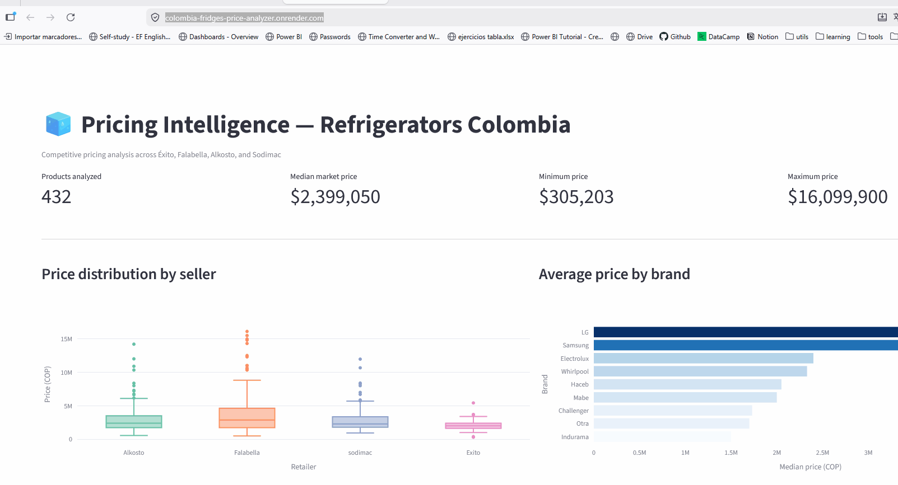

# 🧊 Colombia Fridges Price Analyzer

> A data pipeline that scrapes refrigerator listings from major Colombian e-commerce platforms, stores them in a cloud PostgreSQL database, and exposes a Streamlit dashboard for price intelligence and market analysis.

**Live Dashboard → [colombia-fridges-price-analyzer.onrender.com](https://colombia-fridges-price-analyzer.onrender.com/)**

---

## 📌 Business Motivation

Buying a refrigerator in Colombia means navigating four major retailers — each with its own pricing strategy, seller network, and product catalog. This project answers the practical question: **where should I buy, and is the price fair?**

By automating data collection across Éxito, Falabella, Alkosto, and Sodimac, the dashboard surfaces:

- Average and minimum prices per retailer
- Price distribution across storage capacity, energy rating, and color
- Temporal price trends
- Cross-store comparisons for the same or equivalent products

---

## 🏗️ Architecture

```
E-commerce sites
  (Éxito · Falabella · Alkosto · Sodimac)
        │
        │  Selenium scrapers (Python)
        ▼
  Data Processing & Cleaning
        │
        │  psycopg2 / SQLAlchemy
        ▼
  Supabase (PostgreSQL on AWS)
        │
        │  Streamlit queries
        ▼
  Dashboard  ──►  Render (cloud deployment)
```

---

## 🗄️ Database Schema

Two tables are linked by a product URL (`fridge_link` → `link`):

```
specs                          fridges
─────────────────────          ──────────────────────
id          int4  (PK)         link        varchar (PK)
fridge_link varchar (FK) ───►  product     varchar
storage     varchar            price       int4
size        varchar            seller      varchar
energy      varchar
color       varchar
date        date
```

- **`fridges`** — core listing: product name, price, seller, and a unique URL identifier.
- **`specs`** — technical attributes scraped from each product page, linked back to the listing.

Database is hosted on **Supabase** (PostgreSQL 15, connection pooling via PgBouncer on port 6543).

---

## 🕷️ Scrapers

One script per retailer, all built with **Selenium** and a configurable `USER_AGENT`:

| Script | Target site |
|--------|-------------|
| `src/scrapers/exito_scraper.py` | [exito.com](https://www.exito.com/electrodomesticos/refrigeracion/neveras) |
| `src/scrapers/falabella_scraper.py` | [falabella.com.co](https://www.falabella.com.co/falabella-co/category/CATG32130/Refrigeracion) |
| `src/scrapers/alkosto_scraper.py` | [alkosto.com](https://www.alkosto.com/electrodomesticos/grandes-electrodomesticos/refrigeracion/c/BI_0610_ALKOS) |
| `src/scrapers/sodimac_scraper.py` | [homecenter.com.co](https://www.homecenter.com.co/homecenter-co/category/cat10850/neveras-y-nevecones/) |

Each scraper collects: product name, price, seller, storage capacity, energy rating, color, dimensions, and product URL. A full run across all four stores takes **15 minutes to 1 hour** depending on network speed and number of listings.

---

## ⚙️ Tech Stack

| Layer | Technology |
|-------|------------|
| Language | Python 3.11 |
| Scraping | Selenium |
| Database | PostgreSQL (Supabase) |
| Dashboard | Streamlit |
| Deployment | Render |

---

## 🚀 Getting Started

### 1. Clone the repository

```bash
git clone https://github.com/juanes-grimaldos/web-scrapy-database.git
cd web-scrapy-database
```

### 2. Create a virtual environment

```bash
python -m venv venv

# macOS / Linux
source venv/bin/activate

# Windows
.\venv\Scripts\activate
```

### 3. Install dependencies

```bash
pip install -r requirements.txt
```

### 4. Configure environment variables

Create a `.env` file in the project root (or export variables in your shell):

```env
PYTHONPATH=src

# Supabase / PostgreSQL connection
POSTGRES_USER=postgres.cjdznvjsoxkkkkozomal
POSTGRES_PASSWORD=your_supabase_password
POSTGRES_PORT=6543
POSTGRES_DB=postgres
POSTGRES_SERVER=aws-0-us-west-2.pooler.supabase.com

# Browser identity for Selenium
USER_AGENT=Mozilla/5.0 (Windows NT 10.0; Win64; x64) AppleWebKit/537.36 (KHTML, like Gecko) Chrome/125.0.0.0 Safari/537.36

# Debugger timeout (optional, useful for long scraping sessions)
PYDEVD_INTERRUPT_THREAD_TIMEOUT=120
```

> **Note:** `POSTGRES_PORT=6543` uses Supabase's transaction-mode connection pooler (PgBouncer). Use port `5432` only for direct connections.

---

## 🕷️ Running the Scrapers

Run each script individually:

```bash
python src/scrapers/exito_scraper.py
python src/scrapers/falabella_scraper.py
python src/scrapers/alkosto_scraper.py
python src/scrapers/sodimac_scraper.py
```




The scrapers require **Google Chrome** and a matching `chromedriver` on your `PATH`. Download the driver matching your Chrome version from [chromedriver.chromium.org](https://chromedriver.chromium.org/downloads).

---

## 📊 Running the Dashboard Locally

```bash
streamlit run src/dashboard/app.py
```



The app will open at `http://localhost:8501`.

---

## ☁️ Deployment on Render

The dashboard is deployed as a **Render Web Service** running Streamlit. To deploy your own instance:

1. Push your code to GitHub.
2. Create a new **Web Service** on [render.com](https://render.com) pointing to your repo.
3. Set the **Start Command**:
   ```
   streamlit run src/dashboard/app.py --server.port $PORT --server.address 0.0.0.0
   ```
4. Add all environment variables from the `.env` section above in the Render dashboard under **Environment**.

---

## 📁 Project Structure

```
web-scrapy-database/
├── src/
│   ├── web-scrapy/
│   │   ├── exito_scraper.py
│   │   ├── falabella_scraper.py
│   │   ├── alkosto_scraper.py
│   │   └── sodimac_scraper.py
│   ├── dashboard/
│   │   └── app.py
│   └── data_bases/
│       └── model_diagram.drawio.png
├── .streamlit/
│   └── config.toml
├── .devcontainer/
├── requirements.txt
├── .gitignore
├── LICENSE
└── README.md
```

---

## 📄 License

This project is licensed under the MIT License. See [LICENSE](LICENSE) for details.